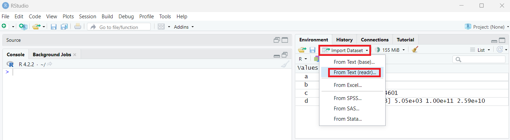
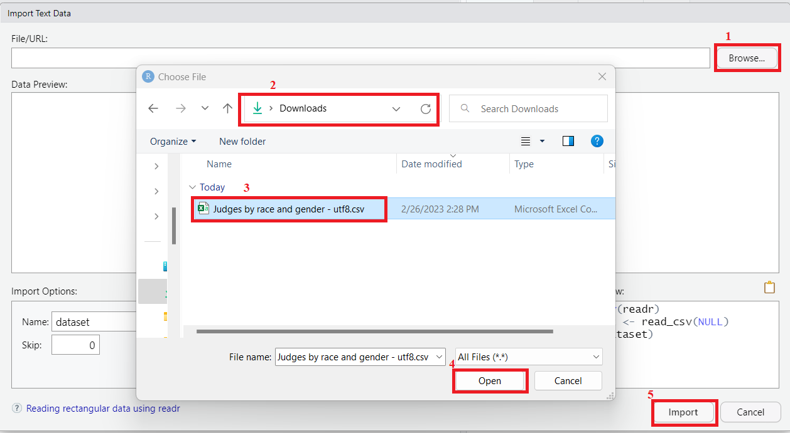

## Practice 3

The following screenshot shows how to download and import the 2016 and 2021 Census data about the race and gender of judges in Canada <https://abacus.library.ubc.ca/dataset.xhtml?persistentId=hdl:11272.1/AB2/PG2NB4>. The dataset is retrieved from [Abacus](https://abacus.library.ubc.ca/). Try follow the steps to import the data into your RStudio.

<p align="center">

 <em>Figure 4. Download Data from Abacus</em>

</p>

<p align="center">

 <em>Figure 5. Find the Downloaded File and Copy Download Link</em>

</p>

<p align="center">

 <em>Figure 6. Import Dataset through Environment</em>

</p>

<p align="center">

 <em>Figure 7. Import Dataset Option 1 Paste URL</em>

</p>

<p align="center">

 <em>Figure 8. Import Dataset Option 2 Browse File</em>

</p>

## Working Directory

I copied the following code from the Code Preview section on the bottom right corner in Figure 7 when importing data by URL.


``` r
library(readr)
X104526_gbrecs_true <- read_csv("https://abacus.library.ubc.ca/api/access/datafile/104526?gbrecs=true")
View(X104526_gbrecs_true)
```

Using these code, others can easily import the target data in the URL, much easier than following the series of screenshots in practice 3. Such a nuance could also contribute to research transparency and reproducibility. Let's paste these code to a script and save it for future use.

*Note:* on your own computer, if you set your working directory to where the .csv file is, you would use X104526_gbrecs_true \<- read.csv("filename.csv"). It's best to keep the file name **free from spaces** and any characters that are not **"-"** or \*\*"\_"\*\*.

<p align="center">

 <em>Figure 9. Save a Script</em>

</p>

When you click the save button, a pop-out window will ask you to specify where to save the script. If we have several files to save, such as plots and datasets, we can avoid them from popping out repeatedly by setting the working directory. **Working directory** is a file path on your computer that sets the default location of any files you read into R, or save out of R. To set the working directory, you can go to the toolbar or use code.

<p align="center">

 <em>Figure 10. Set Working Directory</em>

</p>


``` r
getwd() # Get working directory
setwd() # Set working directory
```