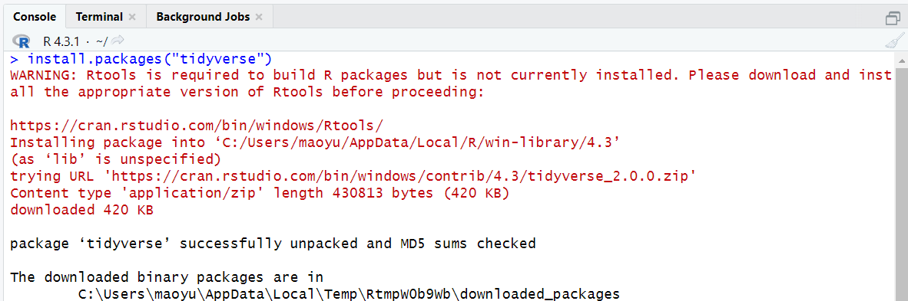
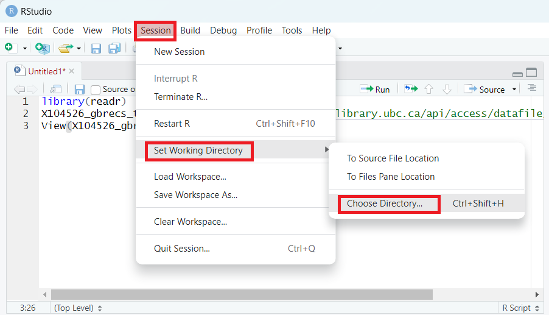

# **Concepts and Basic Syntax**

## 1. What Does Code Look Like in R?

**Example: R as a simple calculator**
``` r
# R as a calculator
2 + 2
10 * 5
sqrt(16)
```

**Example: Creating your first variable**
``` r
my_age <- 33
my_name <- "Demian"
```

---

## 2. Operators

In R, an operator is a special symbol or keyword used to perform operations on one or more values. There are several types of operators in R, including:

### **Assignment Operators**: 
These operators are used to assign a value to a variable. Examples include `<-` and `=`.

``` r
iris_dataframe = iris
```

  
[Image Source: CodeSignal](https://codesignal.com/learn/courses/intro-to-unsupervised-machine-learning/lessons/exploring-and-visualizing-the-iris-dataset)


### **Arithmetic Operators**: 
These operators are used to perform basic mathematical operations such as addition (+), subtraction (-), multiplication (*), and division (/). Type `?Arithmetic` to read the R document in the help tab.

### **Logical Operators**: 
These operators are used to perform logical operations  Examples include: AND (&), OR (|), and NOT (!).  Type `?base::Logic` to read the R document in the help tab. 

### **Comparison Operators**: 
These operators are used to compare two values or variables and return a logical value of TRUE or FALSE. Examples include: less than (<), greater than (>), exactly equal to (==), and not equal to (!=)


### **Miscellaneous Operators and Common Symbols**: 
    -   the hash sign `#` indicates a comment in the code (tip ##### at the end of a comment creates a section that you can open and close as needed),
    -   the colon sign `:` creates a sequence of numbers,
    -   the square bracket `[]` indexes an object such as a vector,
    -   the dollar sign `$` accesses a variable from a data frame (for example from the dataframe *mtcars*, access the *mpg* variable with *mtcars\$mpg*),
    -   the percent sign `%` is used for special operators like modulo and in the tidyr package to string operations together,
    -   and the double colon `::` used to access functions or variables from a specific package.

Understanding how to use these different types of operators is important for writing efficient and effective code in R.

## 3. Functions and Packages

### Function

**Concept:** Functions are like recipes - give them ingredients, get results

When we calculate the sum of all the integers from 1 to 100, we use a formula to help simplify the calculation. What if we cannot memorize the formula? Does it mean that we have to sum those integers brute force by typing 1 + 2 + 3 + ... all the way up to 100? We can use a built-in function `sum()` with the colon operator `:`.

``` r
sum(1:100)
```

In R, a **function** is a block of code that performs a specific task and can be called or executed by the user. Functions are an essential part of R programming because they allow you to automate tasks and reuse code. As a R user, you can rely on functions heavily.

When R is installed, it comes with a default package named `base`, which contains some **built-in functions** that you can use. For example,

| `mean()` \| Calculates the arithmetic mean of a vector of numbers
| `sd()` \| Calculates the standard deviation of a vector of numbers
| `str()` \| Displays the structure of an R object
| `table()` \| Creates a frequency table of a vector or factor
| `plot()` \| Creates a basic plot of data

**Common functions in action:**
``` r
# Descriptive statistics
mean(iris$Sepal.Length)
sd(iris$Sepal.Length)
summary(iris$Sepal.Length)

# Visualization
plot(iris$Sepal.Length, iris$Sepal.Width)
```

**Practice:** Find the maximum petal length in the iris dataset

Let's subset the iris_dataframe to test these out. Let's keep the setosa species with a sepal length below 5


``` r
s_below5 = subset(iris_dataframe, 
                   iris_dataframe$Species == "setosa" &
                     iris_dataframe$Sepal.Length <5)
```


## Practice 1

Compare the magnitude of the following numbers: 
    a) the sum of all integers from 1 to 100, 
    b) 9 to the power of 10, 
    c) 10 to the power of 9

<details>

<summary>Solution</summary>

b>c>a

</details>


### Packages

**Analogy:** R comes with basic apps (base R), packages are like downloading new apps

As introduced earlier, R is powerful partially because it is extensible by installing additional packages quickly. In R, a **package** is a collection of functions, data, and documentation.

Packages can be installed using the `install.packages()` function, which downloads the package from a repository (usually cran) and installs it on your system. Once a package is installed, its functions and data can be loaded into the R environment using the `library()` function. You **do not need to install a package repeatedly, but you do need to library it again in order to use it every time when you restart the RStudio.** If you want to use a function from a package without library(), you can use the double colon operator, for example, `dplyr::filter()`, where `dplyr` is the package name, and `filter()` is a function from the package.

## Practice 2

The `tidyverse` is a collection of popular R packages for data manipulation and visualization. Use the following commands to install and load the `tidyverse` package:


``` r
install.packages("tidyverse") # Install package
library(tidyverse) # Load package
```

<details>

<summary><u>Click here for outputs</u></summary>

<p><strong>Output 1:</strong></p>



<p>It is likely to get <b>some message in red</b> in the output when you install a package. As long as it says the package is successfully unpacked, you can ignore those message. Go ahead to the next step - load the package.</p>

<p><strong>Output 2:</strong></p>


<p>If you got the same output in the console or find the box for the package checked under the package tab on the bottom right pane, you have successfully loaded the package. The <b>conflits</b> messages in the output indicate that some functions from different packages have the same name. The functions from the currently loaded package will be used as default if you do not specify the package from which the function should be used.</p>


<p>However, if you get the output that says there is no such package, your installation step has unresolved issues. Try update your R and RStudio to the latest version and install again.</p>


:::

</details>

**Teaser:** Here's what you can create with ggplot2 (from tidyverse)
``` r
library(ggplot2)
ggplot(iris, aes(x = Sepal.Length, y = Sepal.Width, color = Species)) +
  geom_point()
```

## 4. Data Type, Vector, and Data Frame

### Data Types

In R, there are several **data types** that are commonly used, including

| `Numeric` \| Represents numbers with decimal points. Can be either integers (e.g., 3, 7) or double/floating-point numbers (e.g., 3.14, 2.5e-3). 
| `Character` \| Represents text strings. Enclosed in quotes (e.g., "hello", 'world'). 
| `Factor` \| Represents categorical data with a fixed set of possible values or levels (e.g., "cactus", "orchid").
| `Logical` \| Represents Boolean values (TRUE or FALSE) or logical values (NA, NULL)

Each data type has its own properties and functions that can be used to manipulate and analyze data. Data type is an important concept in R because it affects how the data is stored, processed, and analyzed. Choosing the appropriate data type can help you optimize your memory usage, perform the necessary data manipulations, conduct the appropriate statistical analyses, and create effective visualizations of your data.

### Vector

A **vector** is a basic data structure that represents a sequence of values of *the same data type*. A vector can be created using the `c()` function, which combines values into a vector. For example, to create a vector base on `a`, `b` and `c`, you can use the following code:


``` r
d <- c("a", "b", "c") # create a vector
```

To access an element in a vector, you can use the operator `[]` and a number inside it indicating the position of the element. For example, to access the second element in `d`, the syntax is `d[2]`.

**Example: Track your weekly coffee spending**
``` r
# Individual days
monday_coffee <- 5.50
tuesday_coffee <- 4.25
wednesday_coffee <- 6.00

# Better: use a vector!
weekly_coffee <- c(5.50, 4.25, 6.00, 5.50, 7.00, 0, 8.50)

# Calculate total and average
sum(weekly_coffee)
mean(weekly_coffee)
```

**Why vectors matter:** 
- Store related data together
- Perform calculations on entire dataset
- Foundation for data frames

*Note:* the `c()` function is also used to make lists. This is important for lots of things in R including storing a list of colors to use for plots or keeping a list of objects (e.g. DNA sequences) to subset a dataframe by.

### Data Frame

A **data frame** is a two-dimensional tabular data structure that represents a rectangular grid of data, where each row represents an observation and each column represents a variable. Essentially, a data frame is several equal-length vectors - one for each column. The data in each column must be of the same type, while the data in each row can be different types.


[Image Source: Data Structures](https://zief0002.github.io/epsy-5261/01-03-data-structures-in-r.html)


R comes with several **built-in data frames**. These data sets can be useful for learning and practicing data manipulation, analysis, and visualization techniques. To name a few,

| `iris` \| A data frame containing measurements of the length and width of petals and sepals for three species of iris flowers (setosa, versicolor, and virginica).
| `mtcars` \| A data frame containing information about 32 automobiles, including miles per gallon (mpg), horsepower (hp), and other variables related to performance and design.
| `airquality` \| A data frame containing daily measurements of air quality in New York City in the summer of 1973, including measurements of ozone, particulate matter, and other pollutants.
| `ChickWeight` \| A data frame containing information on the weight of chickens over time, along with details on diet, gender, and other factors that may impact growth.
| `CO2` \| A data frame containing measurements of carbon dioxide uptake in plants, along with information on factors such as light intensity, temperature, and humidity.

These data sets can be accessed by name in R and can be loaded into memory using the `data()` function. For example, to load the `iris` data frame into memory, you can use `data(iris)`.

To access an element in a data frame, you can use the operator `[]` and two numbers inside it indicating the row and column position of the element. For example, to access the element in the second row and fourth column in `iris`, the syntax is `iris[2, 4]`. You can also access a variable in a data frame with the `$` operator, for example, `iris$Sepal.Length` calls out the `Sepal.Length` variable from `iris` dataset.

**Example: Exploring the iris dataset**
``` r
# Load and explore
data(iris)
View(iris)
head(iris)
str(iris)
```

**Simple subsetting:**
``` r
# Get one column
iris$Sepal.Length

# Get one row
iris[1, ]

# Get one cell
iris[1, 4]

# Get setosa species only
setosa_only <- iris[iris$Species == "setosa", ]
```

You can import **foreign data** into R as well. The beginners-friendly way is to import through the Import Dataset button under Environment on the top right pane.

## Practice 3

The following screenshot shows how to download and import the 2016 and 2021 Census data about the race and gender of judges in Canada <https://abacus.library.ubc.ca/dataset.xhtml?persistentId=hdl:11272.1/AB2/PG2NB4>. The dataset is retrieved from [Abacus](https://abacus.library.ubc.ca/). Try follow the steps to import the data into your RStudio.

<p align="center">

 <em>Figure 4. Download Data from Abacus</em>

</p>

<p align="center">

 <em>Figure 5. Find the Downloaded File and Copy Download Link</em>

</p>

<p align="center">

 <em>Figure 6. Import Dataset through Environment</em>

</p>

<p align="center">

 <em>Figure 7. Import Dataset Option 1 Paste URL</em>

</p>

<p align="center">

 <em>Figure 8. Import Dataset Option 2 Browse File</em>

</p>

## 5. Working Directory

I copied the following code from the Code Preview section on the bottom right corner in Figure 7 when importing data by URL.


``` r
library(readr)
X104526_gbrecs_true <- read_csv("https://abacus.library.ubc.ca/api/access/datafile/104526?gbrecs=true")
View(X104526_gbrecs_true)
```

Using these code, others can easily import the target data in the URL, much easier than following the series of screenshots in practice 3. Such a nuance could also contribute to research transparency and reproducibility. Let's paste these code to a script and save it for future use.

*Note:* on your own computer, if you set your working directory to where the .csv file is, you would use X104526_gbrecs_true \<- read.csv("filename.csv"). It's best to keep the file name **free from spaces** and any characters that are not **"-"** or \*\*"\_"\*\*.

<p align="center">

 <em>Figure 9. Save a Script</em>

</p>

When you click the save button, a pop-out window will ask you to specify where to save the script. If we have several files to save, such as plots and datasets, we can avoid them from popping out repeatedly by setting the working directory. **Working directory** is a file path on your computer that sets the default location of any files you read into R, or save out of R. To set the working directory, you can go to the toolbar or use code.

<p align="center">

 <em>Figure 10. Set Working Directory</em>

</p>


``` r
getwd() # Get working directory
setwd() # Set working directory
```

## 6. Some Tips and Tricks

### Organization in R

-   Make folders with descriptive names for each new activity you do in R. Keep all your files in there. Think, using a different **working directory** for each project you work on.

-   When you read files into R, give them a name that is distinctive but easy to type out. Also, dataframe names in R can not start with a number, can not have spaces, and can only have the symbols ".", "-", or "_" in them.

### Open up your data!

-   Many hours of pain can be saved by regularly opening up your dataframes to see if they look right. You know what your data are supposed to look like, they are yours after all.

-   Opening up your dataframes lets you see things like:

    -   Are some data missing?

    -   Are some columns that are supposed to be numeric currently characters? \*\* This is a very common problem!

    -   Did my data manipulation work as intended? see <https://ubc-library-rc.github.io/intro_to_tidyverse/>

``` r
# Open up your data with the View() function. Note the CAPITALIZED V!!!!
View(iris)
```

### What to do when you get errors or don't know how to do something

-   Paste the error message into a search engine or ChatGPT.

-   Check that the solution is for the correct R packages, if you know it and that the solution is for R, not for python. The error messages are usually unique, but it's a good habit to get into as your questions will become more complex over time.

-   If you are figuring out how to do something you have never done before, include the package name (if there is one), the letter R (to avoid python solutions coming up in your results), and the data type (e.g. data frame) along with what you want to do. Lets say I want to plot a dot plot of the **mtcars** data to look at the miles per gallon (x variable) and the count of cars with that miles per gallon (y variable), I would search "*ggplot2 dot plot in R".* Try this out for yourself!

<p style="color:grey; font-size:14px; padding-top: 2em">

This page is meant to introduce some core concepts and basic syntax in R. What questions do you have about the terminologies and sytax? Now is a good time for you to share your questions, thoughts and comments.

</p>
