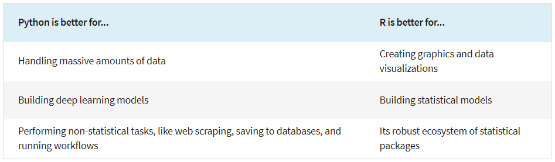

# **[What is R?](https://www.r-project.org/about.html)**  
**Is R the right tool for your data analysis needs?** 

## 1. A software for statistical computing and graphics

R vs other statistical software such as SPSS, SAS, STATA, Mplus, HLM etc. :

### Pros
* <b>Accessibility</b>: R is free and open-source, while other statistical software like SPSS is proprietary software that requires expensive licenses.   
* <b>Extensibility</b>: R has tons of packages available for users to download and use in their analysis. A lot of developers actively maintain their packages and many develop new packages for noval state-of-art analysis.   
(Optional: [Table of available packages in CRAN, sorted by date of publication](https://cran.r-project.org/web/packages/available_packages_by_date.html))   
* <b>Flexibility</b>: R is highly customizable. You can customize plots, functions or even develop packages for your own needs.   
(Optional: [An interesting metaphor](https://rstudio-education.github.io/hopr/preface.html#:~:text=Busses%20are%20very,SPSS.%20%2D%20Greg%20Snow))   
* <b>Reproducibility</b>: R code for data manipulation and analysis can be written and saved in scripts, which can be run anytime to reproduce the results given the raw data and scripts.   
(Optional: [A reproducible example](https://journal.r-project.org/articles/RJ-2022-021/#example-gb-rainfall-paper)  
[CRAN Task View: Reproducible Research](https://cran.r-project.org/web/views/ReproducibleResearch.html))   
* <b>Popularity</b>: R has a larger and more active user community, which provides a wealth of resources and support.   
(Optional: [Getting Help with R](https://support.posit.co/hc/en-us/articles/200552336-Getting-Help-with-R))   

### Cons
* <b>User-friendliness</b>: Other statistical software like SPSS is generally considered to be more user-friendly and easier to learn than R, particularly for users with no programming experience.   
* <b>Authority</b>: A poorly written or unreliable R package is risky, leading to errors or incorrect results. When you are unsure whether a package is trustworthy, it is recommended to check for its popularity, author reputation, and whether it is well-documented, peer-reviewed and actively maintained.   
(Optional: [Check how many downloads a CRAN package has?](https://stackoverflow.com/questions/40835078/check-how-many-downloads-a-cran-package-has)  
[How to Evaluate R Packages?](https://rfortherestofus.com/2020/07/how-to-evaluate-r-packages/)  
[Ten simple rules for finding and selecting R packages](https://journals.plos.org/ploscompbiol/article?id=10.1371/journal.pcbi.1009884)
)   

## 2. A programming language for statistical computing and graphics

R is a specialized language designed for statistical computing and graphics. It is not a general-purpose programming language for software and web development. However, Python, a general-purpose programming language, is popular for data analysis and shares some of R's features like open source and a strong community. It can be a hard call if you want to choose only one.

  

*Source: edX team, [R vs. Python for Data Science: Explainer & Learning Tips](https://blog.edx.org/r-vs.-python-for-data-science-explainer-learning-tips)* 

This page is meant to help you to decide whether R is the right tool for your analysis needs.  
What questions do you have about what R is used for and its pros and cons compared to alternatives? Now is a good time for you to share your questions, thoughts and comments. 
{: .note}