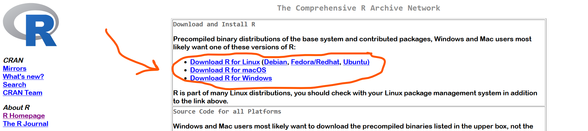
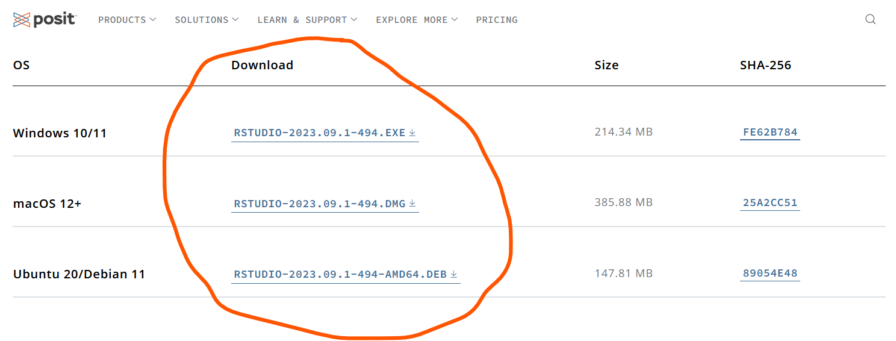
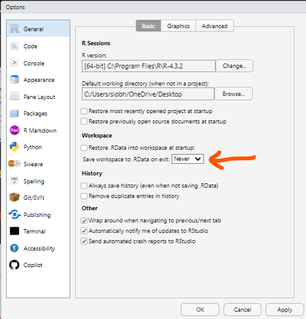

### 1. Install R - the computing software

Go to <https://mirror.rcg.sfu.ca/mirror/CRAN/> and download the right version for your operating system

### 2. Install RStudio - the graphical interface that we will be working in today

Go to <https://posit.co/download/rstudio-desktop/> and scroll to find the right version for your operating system

### 3. Format R

Open *tools > Global Options* and then you will see the pop up below. In the *General* tab, select the "Never" option for Save workspace to .RData on exit.

#### Why are we formatting R like this?

The workspace image (what we just set to *"never save"*) is en entire history of your R session. Although this seems like a good thing to save on the surface, there are a few reasons to not save the workspace image:

1.  It takes up a lot of memory on your computer and makes R start up much slower.

2.  Restarting R and re-running the code in a fresh R session as a troubleshooting method now doesn't work.

3.  If you send your script (R code) to someone else, they don't have your workspace image, so it's possible the script will not work for them when they run it. This is a consequence of no testing code properly, which follows point 2.
 
